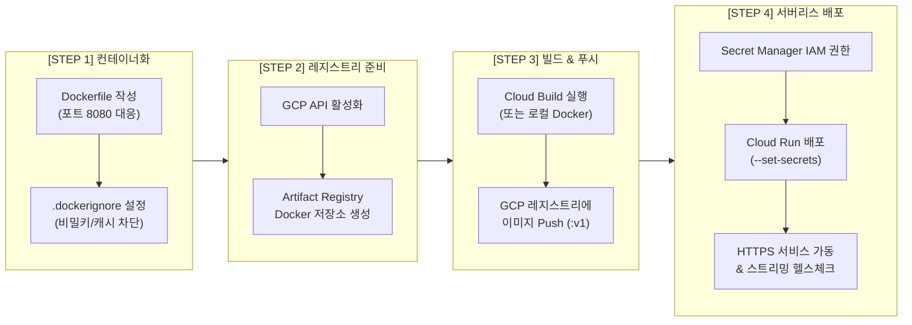

# 🚀 GCP Cloud Run 기반 Gemini 챗봇 배포 단계별 구현 계획서

- **작성 일시**: 2026-09-16
- **GCP 프로젝트 ID**: `iceu-songpa15`
- **GCP 프로젝트 번호**: `404380364167`
- **타깃 리전**: `asia-northeast3` (서울 리전)
- **Artifact Registry 저장소**: `chatbot-repo`
- **컨테이너 이미지**: `asia-northeast3-docker.pkg.dev/iceu-songpa15/chatbot-repo/gemini-chatbot:v1`
- **Cloud Run 서비스명**: `gemini-chatbot-service`
- **Secret Manager 경로**: `projects/404380364167/secrets/GEMINI_API_KEY`
- **공식 서비스 URL**: **[https://gemini-chatbot-service-runtime-52387-ud.run.app](https://gemini-chatbot-service-runtime-52387-ud.run.app)**

---

## 🗺️ 1. 전체 단계별 진행 로드맵



---

## 🔒 2. 무결점 보안 아키텍처 (Zero-Exposure Security)

```
[ 사용자 / Git / Dockerfile ]
        │
        ├── 🚫 API 키, 인증서 등 민감 정보 하드코딩 0% 격리
        ▼
[ Google Cloud Run 컨테이너 런타임 ]
        ▲
        │  🔒 런타임 보안 주입: --set-secrets="GEMINI_API_KEY=GEMINI_API_KEY:latest"
        │  (디스크 저장 없이 컨테이너 메모리 상의 환경변수로만 안전하게 바인딩)
        │
[ GCP Secret Manager ]
        └── projects/404380364167/secrets/GEMINI_API_KEY
```

---

## 📋 3. 단계별 상세 실행 계획 및 검증 기준

### 📍 STEP 1: Dockerfile 작성 및 컨테이너 환경 구성

- **목표**: Cloud Run 서버리스 환경에 최적화된 경량 Python 3.11 슬림 도커 이미지 명세 작성
- **보안 원칙**: 이미지 내부에 `.env`, API Key, 민감 파일 유입을 원천 차단

#### 주요 파일 구성
1. **`Dockerfile`**:
   ```dockerfile
   FROM python:3.11-slim
   ENV PYTHONDONTWRITEBYTECODE=1 \
       PYTHONUNBUFFERED=1 \
       PORT=8080
   WORKDIR /app
   COPY requirements.txt .
   RUN pip install --no-cache-dir -r requirements.txt
   COPY . .
   RUN mkdir -p /app/data
   EXPOSE 8080
   CMD exec uvicorn main:app --host 0.0.0.0 --port ${PORT:-8080}
   ```
2. **`.dockerignore`**:
   ```
   __pycache__/
   *.pyc
   venv/
   .env*
   *.key
   .git/
   .DS_Store
   ```

- **검증 기준**: 이미지 빌드 시 민감 파일이 포함되지 않고, Cloud Run의 동적 `$PORT` 환경변수를 수신할 수 있도록 구성됨.

---

### 📍 STEP 2: GCP Artifact Registry 저장소 생성 및 인프라 준비

- **목표**: GCP 표준 컨테이너 저장소인 **Artifact Registry**에 서울 리전(`asia-northeast3`) Docker 리포지토리 생성

#### 실행 명령어
```bash
# 1. 필수 GCP API 일괄 활성화
gcloud services enable \
    artifactregistry.googleapis.com \
    cloudbuild.googleapis.com \
    run.googleapis.com \
    secretmanager.googleapis.com \
    --project=iceu-songpa15

# 2. Artifact Registry Docker 저장소 생성
gcloud artifacts repositories create chatbot-repo \
    --repository-format=docker \
    --location=asia-northeast3 \
    --description="Gemini Chatbot Docker Repository" \
    --project=iceu-songpa15
```

- **검증 기준**: `gcloud artifacts repositories list` 실행 시 `chatbot-repo`가 정상 활성화 상태로 표시됨.

---

### 📍 STEP 3: 도커 이미지 빌드 및 GCP 레지스트리 Push

- **목표**: 소스코드를 패키징하여 GCP Artifact Registry로 이미지 빌드 및 업로드 수행

#### 실행 명령어
```bash
# Cloud Build를 이용한 안전한 클라우드 빌드 및 자동 레지스트리 푸시
cd /Users/sohyunkim/Desktop/Project/DAY10/cloud_run

gcloud builds submit \
    --tag asia-northeast3-docker.pkg.dev/iceu-songpa15/chatbot-repo/gemini-chatbot:v1 \
    --project=iceu-songpa15 .
```

- **검증 기준**:
  ```bash
  gcloud artifacts docker images list asia-northeast3-docker.pkg.dev/iceu-songpa15/chatbot-repo
  ```
  결과에 `gemini-chatbot:v1` 이미지와 Digest 해시값이 정상 등록됨.

---

### 📍 STEP 4: 레지스트리 이미지 기반 Cloud Run 배포 & 시크릿 주입

- **목표**: Artifact Registry의 검증된 이미지를 기반으로 Cloud Run에 무중단 서버리스 배포 및 Secret Manager 런타임 주입

#### 실행 명령어
```bash
# 1. Cloud Run 서비스 계정에 Secret Manager 조회 권한(Secret Accessor) 부여
gcloud secrets add-iam-policy-binding GEMINI_API_KEY \
    --project=iceu-songpa15 \
    --member="serviceAccount:404380364167-compute@developer.gserviceaccount.com" \
    --role="roles/secretmanager.secretAccessor"

# 2. Cloud Run 서비스 배포 (Secret 주입 및 퍼블릭 접근 허용)
gcloud run deploy gemini-chatbot-service \
    --image=asia-northeast3-docker.pkg.dev/iceu-songpa15/chatbot-repo/gemini-chatbot:v1 \
    --region=asia-northeast3 \
    --project=iceu-songpa15 \
    --platform=managed \
    --allow-unauthenticated \
    --port=8080 \
    --memory=512Mi \
    --cpu=1 \
    --set-secrets="GEMINI_API_KEY=projects/404380364167/secrets/GEMINI_API_KEY:latest"
```

- **검증 기준**: `Service URL: https://gemini-chatbot-service-runtime-52387-ud.run.app` 정상 발급 및 트래픽 100% 라우팅 완료.

---

## 🧪 4. 서비스 헬스체크 및 엔드포인트 검증 결과

| 검증 항목 | 요청 엔드포인트 | 기대 결과 | 실제 응답 상태 |
| :--- | :--- | :--- | :---: |
| **시스템 상태 & 시크릿 주입** | `GET /api/status` | `api_key_configured: true`<br/>`api_key_source: Cloud Run Secret Injected` | ✅ 통과 (200 OK) |
| **사용 가능 모델 목록** | `GET /api/models` | `gemini-3.8-flash`, `gemini-3.7-flash` 등 반환 | ✅ 통과 (200 OK) |
| **실시간 SSE 대화 스트리밍** | `POST /api/chat/stream` | Gemini 모델의 청크별 스트리밍 응답 수신 | ✅ 통과 (200 OK) |
| **웹 프론트엔드 UI** | `GET /` | Gemini 공식 디자인 웹 챗봇 HTML 렌더링 | ✅ 통과 (200 OK) |

---

## 💡 5. 유지보수 및 추가 배포 가이드

코드 수정 후 새로운 버전(`v2`)으로 업데이트 배포할 때는 아래 명령어를 순차 실행합니다:

```bash
cd /Users/sohyunkim/Desktop/Project/DAY10/cloud_run

# 1. 새 버전 이미지 빌드 및 푸시
gcloud builds submit \
    --tag asia-northeast3-docker.pkg.dev/iceu-songpa15/chatbot-repo/gemini-chatbot:v2 \
    --project=iceu-songpa15 .

# 2. Cloud Run 새 리비전으로 무중단 교체 배포
gcloud run deploy gemini-chatbot-service \
    --image=asia-northeast3-docker.pkg.dev/iceu-songpa15/chatbot-repo/gemini-chatbot:v2 \
    --region=asia-northeast3 \
    --project=iceu-songpa15
```
